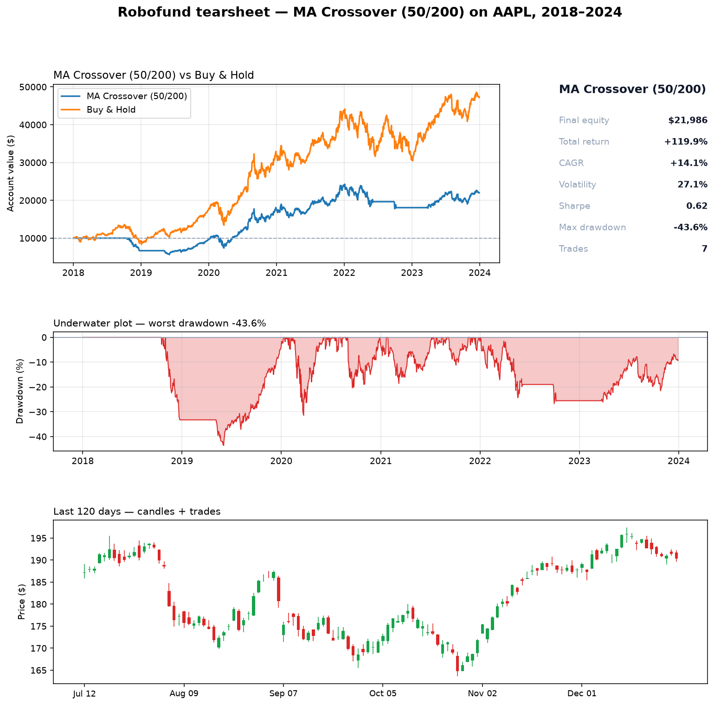
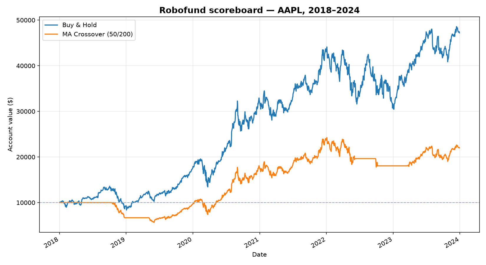
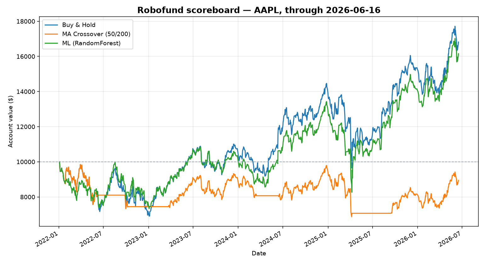

# 🤖 Robofund

**A lab where robot trading strategies compete on market data.**

Each "robot" is a trading strategy with its own rule for when to buy and sell.
Give each one a hypothetical \$10,000 and a pile of real historical prices, and
Robofund replays history day by day to see how every robot *would* have done —
then scores them not just on profit, but on how much risk they took to get there.

It's a backtesting engine built from scratch for learning: the goal isn't to get
rich, it's to understand how markets, trading strategies, and the software that
tests them actually work — and to find out, empirically, why beating a simple
"buy and hold" is so much harder than it looks.



---

## What's going on here?

A **backtest** answers one question: *"if I had followed this rule in the past,
how would I have done?"* Robofund makes that concrete. You define a strategy as a
small plug-in, and the engine simulates trading it one day at a time with a
starting cash balance, tracking every trade and the account's value along the way.

Three robots ship today:

- **Buy & Hold** — buy on day one, never sell. The brutally hard baseline.
- **Moving-Average Crossover** — a trend-follower that holds the stock while a
  fast price average is above a slow one, and retreats to cash when it isn't.
- **ML (RandomForest)** — a machine-learning robot that engineers features from
  price history and trains a classifier to predict next-day direction.

Because every strategy implements the **same interface**, the engine can run any
of them without caring which is which — even the ML model plugs into the exact
same loop. Adding a robot is a small file, not a rewrite.

### The scoreboard

Run both robots over the same six years of Apple stock and you get an honest
head-to-head:



```
Robot                     Final $   Return    CAGR   Sharpe   Max DD   Trades
Buy & Hold                 47,204   372.0%   29.6%     0.98   -38.5%        1
MA Crossover (50/200)      21,986   119.9%   14.1%     0.62   -43.6%        7
```

The trend robot **lost on every metric** — less money, a worse risk-adjusted
return (Sharpe), *and* a deeper drawdown. That's not a bug; it's the lesson.
On a single stock during a roaring bull market, every day the robot spends in
cash is upside it gives up, and a couple of badly-timed exits (selling low,
buying back higher) sealed its fate. Trend-following earns its keep elsewhere —
on broad indices and through full crash cycles — which is exactly the kind of
thing this lab exists to test rather than take on faith.

---

## How it works

Data flows one direction through small, single-purpose modules:

```
yfinance ─▶ DataFeed ─▶ Engine ─▶ Broker ─▶ Metrics ─▶ Plots
                          ▲
                       Strategy
                    (the plug-in rule)
```

| Module | Job |
| --- | --- |
| [`robofund/data.py`](robofund/data.py) | **DataFeed** — the only file that knows about yfinance. Pulls daily prices and hands back immutable `Bar` objects. |
| [`robofund/strategy.py`](robofund/strategy.py) | **Strategy** — the plug-in interface every robot implements: given the history it's allowed to see, return a target weight (0.0 = all cash, 1.0 = fully invested). |
| [`robofund/broker.py`](robofund/broker.py) | **Broker** — tracks cash and shares, executes trades, and charges commission. Strategies never touch share math; the broker does. |
| [`robofund/engine.py`](robofund/engine.py) | **Engine** — the event-driven simulator that replays bars one day at a time. The heart of the project. |
| [`robofund/metrics.py`](robofund/metrics.py) | **Metrics** — turns an equity curve into scores: total return, CAGR, volatility, Sharpe ratio, max drawdown. |
| [`robofund/plotting.py`](robofund/plotting.py) | **Plotting** — reusable charts: equity curves, the underwater drawdown plot, and candlesticks with trade markers. |
| [`robofund/features.py`](robofund/features.py) | **Features** — turns raw prices into backward-only signals (returns, volatility, RSI, momentum, volume) for the ML robot. |
| [`robofund/ml_strategy.py`](robofund/ml_strategy.py) | **ML strategy** — wraps a trained scikit-learn classifier as a robot that invests when it predicts "up." |
| [`robofund/report.py`](robofund/report.py) | **Report** — builds the daily scoreboard, clips it to the live (out-of-sample) window, and persists a running ledger. |

### The one idea that matters: no peeking at the future

The engine's daily cycle is deliberately ordered to make **look-ahead bias**
(accidentally letting a strategy "see" tomorrow) structurally impossible:

```
1. EXECUTE yesterday's decision, filling at today's OPEN price
2. MARK    the account to market at today's CLOSE, and record equity
3. DECIDE  tomorrow's target — using data only through today's close
```

Why decide today but trade tomorrow? In real life you can't see a day's closing
price *and* trade at that same close — by the time you know the close, the day is
over. Encoding that one-day gap means a decision made from today's close can only
be acted on at the next day's open. The strategy is physically handed only the
bars up to today (`history[: i + 1]`), so it *cannot* cheat. This is the single
most common way backtests lie, and the engine is designed so it can't happen.

That same property has a bonus: because the engine processes bars in real-world
order, the *exact same loop* runs on this morning's bar just as well as a
historical one — turning a backtest into live paper trading with no rewrite.
That's exactly what the daily scoreboard below does.

### The daily scoreboard

[`scripts/daily.py`](scripts/daily.py) is the "run it every morning" command. It
pulls fresh data through today, runs the whole fund, prints **each robot's order
for the next trading day**, scores them over the live out-of-sample window (every
robot restarted at the same $10k), saves a chart, and appends a dated row to a
running ledger — so a genuine forward track record grows one day at a time.



Honesty note baked into the code: the ML robot needs years of past data to train,
so it runs over full history — but the scoreboard only *scores* the period it was
never trained on. An earlier version accidentally scored the in-sample years too
and the ML robot showed a fake +2,000% return; clipping to the live window
([`clip_to_live`](robofund/report.py)) is what keeps the numbers truthful.

### Reading the tearsheet

The [tearsheet](docs/images/tearsheet.png) at the top packs four views into one card:

- **Equity curves** — each robot's account value over time.
- **Stats box** — the numbers a real fund would quote.
- **Underwater plot** — drawdown over time, shaded below the "all-time-high"
  waterline. Deep, wide pools are long, painful stretches spent below a past
  peak. It's the most honest picture of risk there is.
- **Candlesticks + trades** — the recent price action as candlestick bars (green
  = up day, red = down day), with the robot's buy ▲ / sell ▼ markers overlaid so
  you can see exactly when it acted.

### What the metrics mean

| Metric | Plain-English meaning |
| --- | --- |
| **Total return** | Overall gain over the whole run. |
| **CAGR** | The steady yearly growth rate that would produce the same result — lets you compare runs of different lengths. |
| **Volatility** | How bumpy the ride was (annualized scatter of daily returns). |
| **Sharpe ratio** | Return earned *per unit of bumpiness*. Higher = the returns were earned more efficiently. This is how a smoother robot can beat a flashier one. |
| **Max drawdown** | The worst peak-to-trough fall. A -40% drawdown means the account once lost 40% from a high — the best gut-check for pain. |

---

## Quickstart

```bash
# 1. Set up an isolated environment
python -m venv .venv
source .venv/bin/activate          # Windows: .venv\Scripts\activate
pip install -r requirements.txt

# 2. Run things
python scripts/first_plot.py       # Phase 1: plot a ticker's price
python scripts/run_backtest.py     # Phase 2: run one robot through the engine
python scripts/compare.py          # Phase 3: head-to-head scoreboard
python scripts/tearsheet.py        # Phase 4: the full summary card
python scripts/ml_backtest.py      # Phase 5: train + test the ML robot
python scripts/daily.py            # Phase 6: the daily scoreboard + ledger
```

Want to test your own idea? Open [`scripts/compare.py`](scripts/compare.py),
change `TICKER` to any symbol, adjust the dates, or add another robot to the
`ROBOTS` list — it joins the scoreboard automatically.

---

## Project layout

```
robofund/            # the engine — importable package
  data.py            # DataFeed: prices in, Bars out
  strategy.py        # the Strategy interface + Buy & Hold + MA Crossover
  broker.py          # cash, shares, commissions, trade log
  engine.py          # the event-driven simulator
  metrics.py         # scoring an equity curve
  plotting.py        # the chart toolkit
  features.py        # price -> ML features (returns, RSI, momentum, volume)
  ml_strategy.py     # a trained classifier wrapped as a robot
  report.py          # daily scoreboard + running ledger
scripts/             # runnable entry points, one per phase
  first_plot.py · run_backtest.py · compare.py
  tearsheet.py · ml_backtest.py · daily.py
docs/images/         # charts embedded in this README
reports/             # daily.py output: ledger.csv, scoreboard.png (gitignored)
```

---

## Roadmap

Robofund is built in phases — each one ends with something working you can run.

1. **Data + first plot** — prove the toolchain works. ✅
2. **The engine** — strategy interface + a simulator that replays bars. ✅
3. **First real strategy** — moving-average crossover + metrics + scoreboard. ✅
4. **Polish the visuals** — drawdowns, candlesticks with trade markers, tearsheet. ✅
5. **ML strategy** — engineer features, train a classifier to predict next-day
   direction, and backtest it as just another robot. ✅
6. **Live daily scoreboard** — run every robot on fresh daily data, read off each
   one's order for tomorrow, and grow a running ledger you check each morning. ✅

All six phases are built. Next ideas: more strategies, a basket of tickers,
transaction-cost realism everywhere, and automating the daily run.

---

## Built with

- **Python 3.12+**
- [**yfinance**](https://github.com/ranaroussi/yfinance) — historical market data
- **pandas** — data wrangling
- **matplotlib** — all charts, drawn from scratch (no charting library)

Standard backtesting libraries like `backtrader` and `vectorbt` exist and do all
this for you — Robofund is built by hand on purpose, to *understand* the moving
parts rather than hide them.

---

## Why I built this

I'm a recent University of Michigan grad exploring the intersection of software
engineering, finance, and machine learning. Robofund is my hands-on way to learn
all three at once — clean system design, real market concepts, and data
visualization — while building something I actually want to keep opening. It's a
work in progress, growing one phase at a time.
